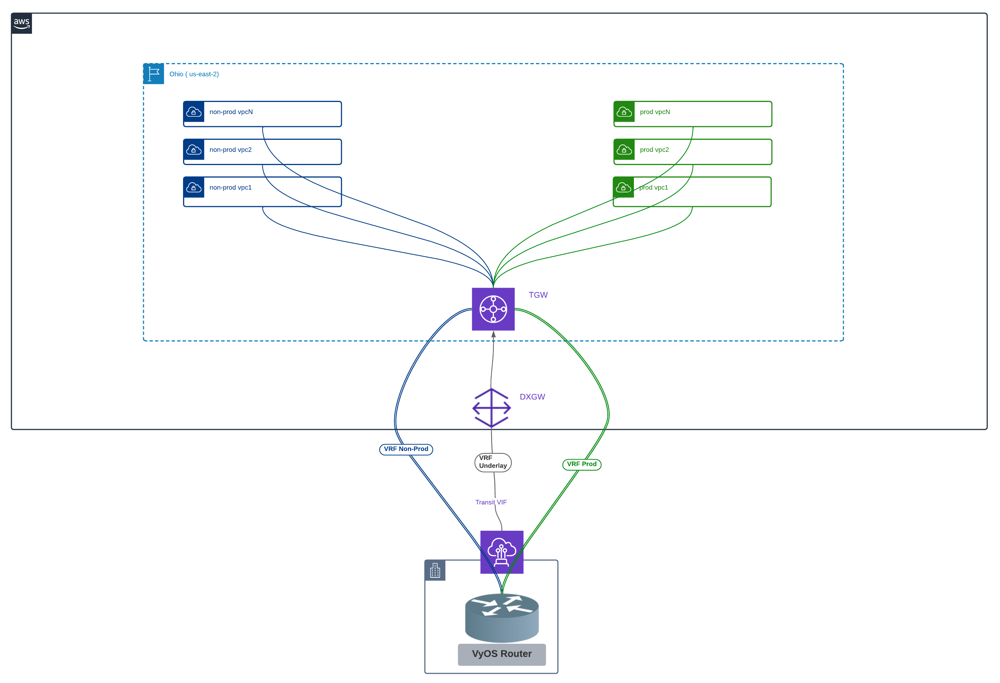

# Aviatrix TGW Cnnect over DX on AWS Demo Topology

The code provided is for demo purposes only.



Password hash for API (admin-api user) is generated via the "request password-hash" CLI command.
https://knowledgebase.paloaltonetworks.com/KCSArticleDetail?id=kA10g000000PPkCCAW

- Default username/password: admin/Aviatrix123#
- Default api username/password: admin-api/Aviatrix123#

## Prerequisites

Please make sure you have:
- Aviatrix Controller 6.6
- AWS access accounts are onboarded. Variable for AWS access account is 'aws_account_name'

## Variables

To run this project, you will need to provide the variables listed in Inputs Section


## Run Locally

Clone the project

```bash
git clone https://github.com/arahimidris/avx66-tgw-connect-overdx.git
```

Go to the project directory

```bash
cd avx-tgwconnect-overdx
```

Set variables using tfvar or environment variables


Terraform workflow

```bash
terraform init
terraform plan
terraform apply -auto-approve
```


## Required Inputs


| Name | Description | Default | Required |
|------|-------------|---------|----------|
| username | Aviatrix controller username | None | yes |
| password | Aviatrix controller password | None | yes |
| controller_ip | Aviatrix controller ip address | None | yes |
| aws_account_name | AWS account name | None | yes |
| dxcon_name | AWS Direct Connect connection name | None | yes |
| vm_admin_password | Password to login to Test EC2 isntances | None | yes |
| num_connect_peers | Number of connect peers per TGW Connect attachment | `4` | yes |
| gw.dxgw.asn | DXGW BGP ASN | `65000` | yes |
| gw.dxgw.name | DXGW Name| `tf-dxgw-tgw-connect` | yes |
| gw.ce.prod_asn | BGP ASN of Prod VRF on CE | `64521` | yes |
| gw.ce.nonprod_asn | BGP ASN of NonProd VRF on CE | `64522` | yes |
| gw.ce.connect_peerip | Tunnel Source IP on CE , advertised on underlay VRF| `10.1.0.1` | yes |
| gw.tgw.asn | AWS Transit Gateway (TGW) BGP ASN | `65001` | yes |
| gw.tgw.name |  AWS Transit Gateway (TGW) name| `TGW-Connect-demo` | yes |
| gw.tgw.cidr | AWS Transit Gateway (TGW) CIDR - used as Tunnel Source for TGW Connnect Peering | `10.0.0.0/24` | yes |
| tvif.name | Tranist VIF name | `tvif-tgwconnect` | yes |
| tvif.mtu | Tranist VIF MTU | `8500` | yes |
| tvif.vlanid | Tranist VIF VLAN ID (incase of hosted connection) | `309` | yes |
| tvif.amzn_address| Tranist VIF Amazon side IP (used on DXGW/Amazon Logical Device)  | `"192.168.1.0/31` | yes |
| tvif.ce_address | Tranist VIF Customer side IP  | `192.168.1.1/31` | yes |
| tvif.bgp_authkey | Tranist VIF BGP MD5  | `Aviatrix123` | yes |
| tvif.ce_asn | BGP ASN used on CE device in underlay VRF  | `64512` | yes |
| prod_inside_cidr | BGP inside CIDR for Prod Connect Peering | `"169.254.100.0/29", "169.254.100.8/29", "169.254.100.16/29", "169.254.100.24/29"` | yes |
| nonprod_inside_cidr | BGP inside CIDR for Non-Prod Connect Peering | `"169.254.101.0/29", "169.254.101.8/29", "169.254.101.16/29", "169.254.101.24/29"` | yes |
| tgw_peerip_prod | TGW Peer IP (tunnel source) for Prod Connect Peers | `"10.0.0.0", "10.0.0.1", "10.0.0.2", "10.0.0.3"` | yes |
| tgw_peerip_nonprod |  TGW Peer IP (tunnel source) for NonProd Connect Peers | `"10.0.0.4", "10.0.0.5", "10.0.0.6", "10.0.0.7"` | yes |
| environments | Specify TGW different Connect attachment types | `"Prod-Connect", "NonProd-Connect"` | yes |
| mandatory-domains | Specify mandatory TGW domains required by TGW orchestrator | `"Shared_Service_Domain", "Aviatrix_Edge_Domain", "Default_Domain"` | yes |
| domains | Specify additional TGW Security Domains | `"DX", "Prod", "NonProd"` | yes |
| vpcs.prod.vpccidr |  NonProd VPC CIDR  | `172.16.0.0/24` | yes |
| vpcs.prod.aws_region | AWS Region for NonProd VPC | `us-east-2` | yes |
| vpcs.prod.aws_account_name | AWS account used to create NonProd VPC | `arahim-corp-aws` | yes |
| vpcs.prod.create_ec2 | Create test EC2 instance in NonProd VPC | `true` | yes |
| vpcs.prod.secdomain | AWS TGW Security Domain to assosciate NonProd VPC | `Prod` | yes |
| vpcs.nonprod.vpccidr |  NonProd VPC CIDR  | `172.16.1.0/24` | yes |
| vpcs.nonprod.aws_region | AWS Region for NonProd VPC | `us-east-2` | yes |
| vpcs.nonprod.aws_account_name | AWS account used to create NonProd VPC | `arahim-corp-aws` | yes |
| vpcs.nonprod.create_ec2 | Create test EC2 instance in NonProd VPC | `true` | yes |
| vpcs.nonprod.secdomain | AWS TGW Security Domain to assosciate NonProd VPC | `NonProd` | yes |

## Outputs

After complete deployment , 

- The EC2 instance in Prod VPCs should be able to access 10.11.0.1/32 (dum11 interface in 'prod' vrf on vyos appliance ).
- The EC2 instance in NonProd VPCs should be able to access 10.12.0.1/32 (dum21 interface in 'nonprod' vrf on vyos appliance ).

Below are some of the outputs from the VyoS appliance

```bash
arahim@AR-onprem:~$ show vrf
VRF name          state     mac address        flags                     interfaces
--------          -----     -----------        -----                     ----------
nonprod           up        62:f7:16:92:c5:f3  noarp,master,up,lower_up  dum21,tun7,tun6,tun4,tun5
prod              up        0e:c7:f7:bd:d5:81  noarp,master,up,lower_up  dum11,tun1,tun0,tun3,tun2
underlay          up        a6:ad:34:55:df:14  noarp,master,up,lower_up  eth1,dum1

arahim@AR-onprem:~$ show interfaces 
Codes: S - State, L - Link, u - Up, D - Down, A - Admin Down
Interface        IP Address                        S/L  Description
---------        ----------                        ---  -----------
dum1             10.1.0.1/32                       u/u  
dum11            10.11.0.1/24                      u/u  
dum21            10.12.0.1/24                      u/u  
dum111           -                                 u/u  
eth0             104.152.199.164/27                u/u  Public Interface
eth1             192.168.1.1/31                    u/u  arahim-eth1-1G-2527
eth2             192.168.2.1/31                    A/D  arahim-eth2-50m-2205
eth3             192.168.3.1/31                    A/D  arahim-eth3-50m-2100
lo               127.0.0.1/8                       u/u  
                 ::1/128                                
tun0             169.254.100.1/29                  u/u  
tun1             169.254.100.9/29                  u/u  
tun2             169.254.100.17/29                 u/u  
tun3             169.254.100.25/29                 u/u  
tun4             169.254.101.1/29                  u/u  
tun5             169.254.101.9/29                  u/u  
tun6             169.254.101.17/29                 u/u  
tun7             169.254.101.25/29                 u/u  
arahim@AR-onprem:~$ show ip route vrf underlay
Codes: K - kernel route, C - connected, S - static, R - RIP,
       O - OSPF, I - IS-IS, B - BGP, E - EIGRP, N - NHRP,
       T - Table, v - VNC, V - VNC-Direct, A - Babel, D - SHARP,
       F - PBR, f - OpenFabric,
       > - selected route, * - FIB route, q - queued, r - rejected, b - backup

VRF underlay:
K>* 0.0.0.0/0 [255/8192] unreachable (ICMP unreachable), 04w1d01h
B>* 10.0.0.0/24 [20/0] via 192.168.1.0, eth1, weight 1, 02:36:14
C>* 10.1.0.1/32 is directly connected, dum1, 03w6d19h
C>* 192.168.1.0/31 is directly connected, eth1, 04w1d01h
arahim@AR-onprem:~$ show ip route vrf prod
Codes: K - kernel route, C - connected, S - static, R - RIP,
       O - OSPF, I - IS-IS, B - BGP, E - EIGRP, N - NHRP,
       T - Table, v - VNC, V - VNC-Direct, A - Babel, D - SHARP,
       F - PBR, f - OpenFabric,
       > - selected route, * - FIB route, q - queued, r - rejected, b - backup

VRF prod:
K>* 0.0.0.0/0 [255/8192] unreachable (ICMP unreachable), 04w1d01h
C>* 10.11.0.0/24 is directly connected, dum11, 04w1d01h
C>* 169.254.100.0/29 is directly connected, tun0, 04w1d01h
C>* 169.254.100.8/29 is directly connected, tun1, 04w1d01h
C>* 169.254.100.16/29 is directly connected, tun2, 04w1d01h
C>* 169.254.100.24/29 is directly connected, tun3, 04w1d01h
B>* 172.16.0.0/24 [20/100] via 169.254.100.2, tun0, weight 1, 00:52:41
  *                        via 169.254.100.3, tun0, weight 1, 00:52:41
  *                        via 169.254.100.10, tun1, weight 1, 00:52:41
  *                        via 169.254.100.11, tun1, weight 1, 00:52:41
  *                        via 169.254.100.18, tun2, weight 1, 00:52:41
  *                        via 169.254.100.19, tun2, weight 1, 00:52:41
  *                        via 169.254.100.26, tun3, weight 1, 00:52:41
  *                        via 169.254.100.27, tun3, weight 1, 00:52:41
arahim@AR-onprem:~$ show ip route vrf nonprod
Codes: K - kernel route, C - connected, S - static, R - RIP,
       O - OSPF, I - IS-IS, B - BGP, E - EIGRP, N - NHRP,
       T - Table, v - VNC, V - VNC-Direct, A - Babel, D - SHARP,
       F - PBR, f - OpenFabric,
       > - selected route, * - FIB route, q - queued, r - rejected, b - backup

VRF nonprod:
K>* 0.0.0.0/0 [255/8192] unreachable (ICMP unreachable), 04w1d01h
C>* 10.12.0.0/24 is directly connected, dum21, 04w1d01h
C>* 169.254.101.0/29 is directly connected, tun4, 04w1d01h
C>* 169.254.101.8/29 is directly connected, tun5, 04w1d01h
C>* 169.254.101.16/29 is directly connected, tun6, 04w1d01h
C>* 169.254.101.24/29 is directly connected, tun7, 04w1d01h
B>* 172.16.1.0/24 [20/100] via 169.254.101.2, tun4, weight 1, 00:56:56
  *                        via 169.254.101.3, tun4, weight 1, 00:56:56
  *                        via 169.254.101.10, tun5, weight 1, 00:56:56
  *                        via 169.254.101.11, tun5, weight 1, 00:56:56
  *                        via 169.254.101.18, tun6, weight 1, 00:56:56
  *                        via 169.254.101.19, tun6, weight 1, 00:56:56
  *                        via 169.254.101.26, tun7, weight 1, 00:56:56
  *                        via 169.254.101.27, tun7, weight 1, 00:56:56
arahim@AR-onprem:~$ show ip bgp vrf all summ

Instance nonprod:

IPv4 Unicast Summary:
BGP router identifier 10.12.0.1, local AS number 64522 vrf-id 6
BGP table version 31
RIB entries 3, using 576 bytes of memory
Peers 8, using 170 KiB of memory

Neighbor        V         AS   MsgRcvd   MsgSent   TblVer  InQ OutQ  Up/Down State/PfxRcd   PfxSnt
169.254.101.2   4      65001    101170    168704        0    0    0 02:23:23            1        2
169.254.101.3   4      65001    101151    168675        0    0    0 02:23:05            1        2
169.254.101.10  4      65001     93098    155273        0    0    0 01:08:08            1        2
169.254.101.11  4      65001     93118    155298        0    0    0 01:07:45            1        2
169.254.101.18  4      65001     92615    154462        0    0    0 01:03:57            1        2
169.254.101.19  4      65001     92642    154485        0    0    0 01:04:31            1        2
169.254.101.26  4      65001     45815     76424        0    0    0 00:57:09            1        2
169.254.101.27  4      65001     45812     76430        0    0    0 00:57:03            1        2

Total number of neighbors 8

Instance prod:

IPv4 Unicast Summary:
BGP router identifier 10.11.0.1, local AS number 64521 vrf-id 7
BGP table version 52
RIB entries 3, using 576 bytes of memory
Peers 8, using 170 KiB of memory

Neighbor        V         AS   MsgRcvd   MsgSent   TblVer  InQ OutQ  Up/Down State/PfxRcd   PfxSnt
169.254.100.2   4      65001    102365    170745        0    0    0 02:27:03            1        2
169.254.100.3   4      65001    102345    170708        0    0    0 02:27:04            1        2
169.254.100.10  4      65001     99732    166337        0    0    0 00:53:23            1        2
169.254.100.11  4      65001     99721    166308        0    0    0 00:53:15            1        2
169.254.100.18  4      65001     99965    166726        0    0    0 01:00:46            1        2
169.254.100.19  4      65001    100002    166780        0    0    0 01:01:04            1        2
169.254.100.26  4      65001     99501    165946        0    0    0 01:11:06            1        2
169.254.100.27  4      65001     99514    165959        0    0    0 01:11:03            1        2

Total number of neighbors 8

Instance underlay:

IPv4 Unicast Summary:
BGP router identifier 10.1.0.1, local AS number 64512 vrf-id 8
BGP table version 11
RIB entries 5, using 960 bytes of memory
Peers 1, using 21 KiB of memory

Neighbor        V         AS   MsgRcvd   MsgSent   TblVer  InQ OutQ  Up/Down State/PfxRcd   PfxSnt
192.168.1.0     4      65000     51387     77720        0    0    0 02:45:47            1        3

Total number of neighbors 1

```

