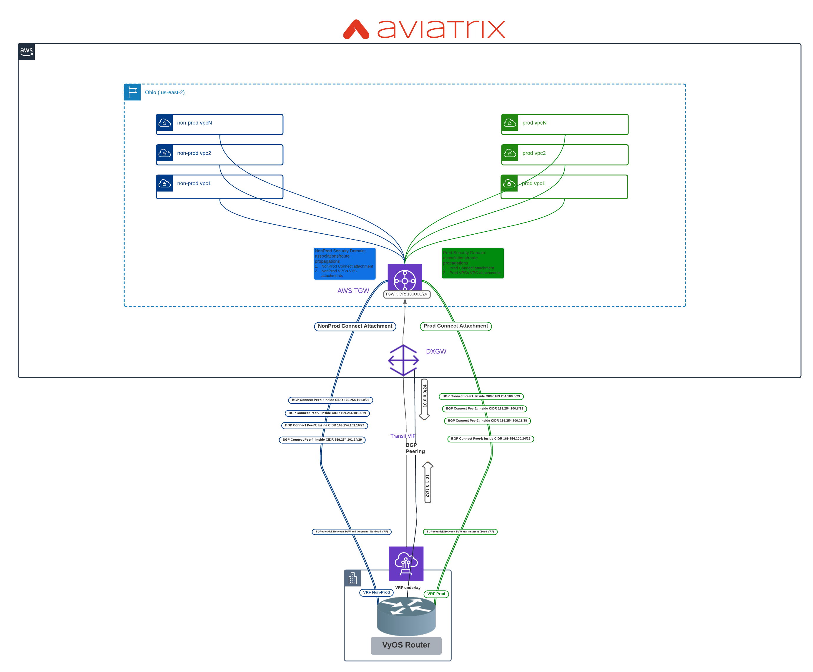

# Aviatrix TGW Cnnect over DX on AWS Demo Topology

The code provided is for demo purposes only.



Password hash for API (admin-api user) is generated via the "request password-hash" CLI command.
https://knowledgebase.paloaltonetworks.com/KCSArticleDetail?id=kA10g000000PPkCCAW

- Default username/password: admin/Aviatrix123#
- Default api username/password: admin-api/Aviatrix123#

## Prerequisites

Please make sure you have:
- Aviatrix Controller 6.6
- AWS access accounts are onboarded. Variable for AWS access account is 'aws_account_name'

## Environment Variables

To run this project, you will need to set the variables


## Run Locally

Clone the project

```bash
git clone https://github.com/arahimidris/avx66-tgw-connect-overdx.git
```

Go to the project directory

```bash
cd avx66-tgw-connect-overdx
```

Set variables using tfvar or environment variables


Terraform workflow

```bash
terraform init
terraform plan
terraform apply -auto-approve
```
## Inputs


| Name | Description | Default | Required |
|------|-------------|---------|----------|
| username | Aviatrix controller username | None | yes |
| password | Aviatrix controller password | None | yes |
| controller_ip | Aviatrix controller ip address | None | yes |
| aws_account_name | AWS account name | None | yes |
| dxcon_name | AWS Direct Connect connection name | None | yes |
| vm_admin_password | Password to login to Test EC2 isntances | None | yes |
| num_connect_peers | Number of connect peers per TGW Connect attachment | `4` | yes |
| gw | Specify ASN , connectivity parameters for DXGW,TGW and Customer Edge device | `refer to variables.tf` | yes |
| tvif | Specify Tranist VIF parameters | `refer to variables.tf` | yes |
| prod_inside_cidr | Specify inside CIDR for Prod Connect attachment | `refer to variables.tf` | yes |
| nonprod_inside_cidr | Specify inside CIDR for Non-Prod Connect attachment | `refer to variables.tf` | yes |
| tgw_peerip_prod | Specify  TGW Peer IP for Prod Connect attachment | `refer to variables.tf` | yes |
| tgw_peerip_nonprod | Specify  TGW Peer IP for Non-Prod Connect attachment | `refer to variables.tf` | yes |
| environments | Specify TGW different Connect attachment types | `refer to variables.tf` | yes |
| mandatory-domains | Specify mandatory TGW domains required by TGW orchestrator | `refer to variables.tf` | yes |
| domains | Specify additional TGW Security Domains | `"DX", "Prod", "NonProd"` | yes |
| vpcs | Specify VPCs with attributes  | `refer to variables.tf` | yes |